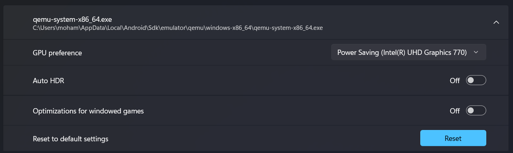
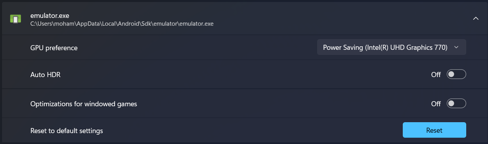
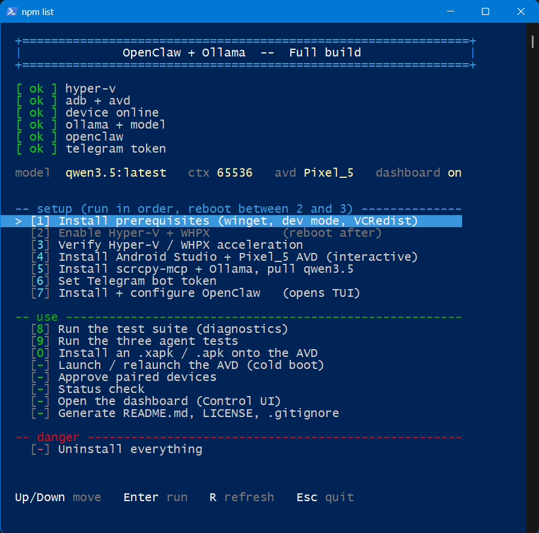
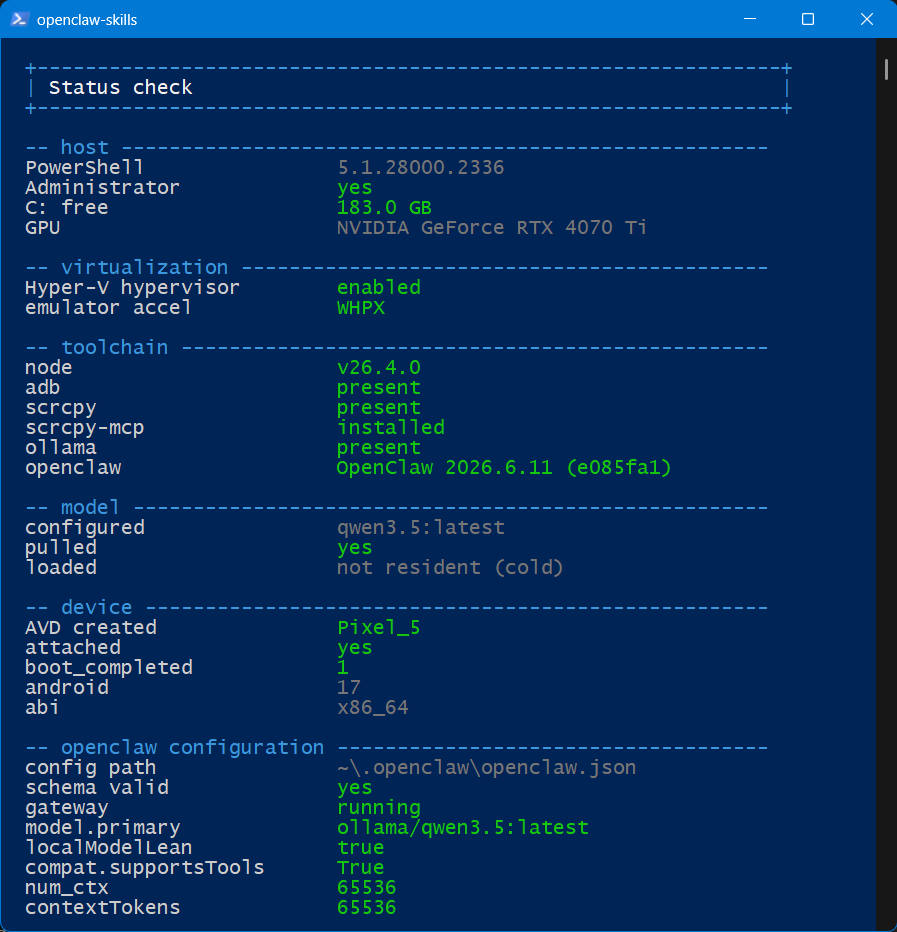
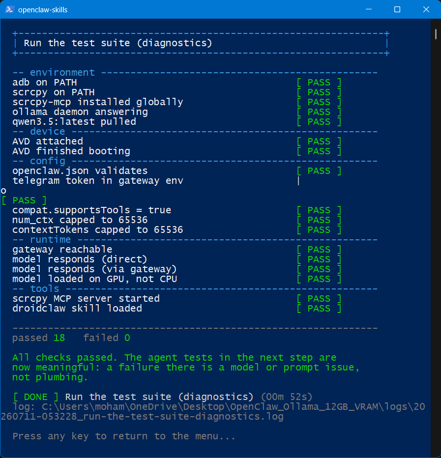

# OpenClaw + Ollama on 12 GB VRAM

A single self-contained PowerShell script that installs, configures, tests,
and uninstalls a fully local AI agent that drives an Android emulator and is
controlled over Telegram.

<https://github.com/alrokayan/OpenClaw_Ollama_12GB_VRAM>

Generated from `OpenClaw_Ollama_12GB_VRAM_Lite.ps1` on 2026-07-11.
Do not edit by hand -- regenerate with the *Generate README.md, LICENSE, .gitignore* menu item.

## Disclaimer

**Run at your own risk.** This script installs system-level components,
enables Hyper-V, writes to the registry, creates a Scheduled Task, and its
uninstall path deletes directories irreversibly. It is provided as-is, with
no warranty of any kind. Read it before running it.

Specific things worth knowing before you start:

- Enabling Hyper-V changes how virtualization works machine-wide. VirtualBox
  and VMware get slower; HAXM stops loading entirely. Disabling it later also
  breaks WSL2, Docker Desktop, and Windows Sandbox.
- The uninstall step deletes `~/.openclaw`, `~/.android` (your AVDs and their
  disk images), and optionally `~/.ollama` (your pulled models). None of it is
  recoverable.
- The Telegram bot token is stored in plaintext in `.\env` and `~/.openclaw/.env`.
  Anyone who can read those files can control your bot. The generated
  `.gitignore` excludes both, plus `openclaw.json` (which holds a gateway token).
  Note the secret file is named `env`, **not** `.env` -- a stock `.env` rule does
  not match it. That is how tokens end up in public history.
- The agent has shell access and can drive a connected Android device. Web
  search is enabled, which means it reads untrusted content. See *Security*.

## Abstract

OpenClaw is a personal AI assistant that bridges messaging apps to agents
through a local gateway. This script wires it to a locally-served Ollama model
and an Android emulator, so an agent you message on Telegram can look at a
phone screen, reason about what it sees, and tap, type, and swipe on it.

Nothing leaves the machine. The model runs on your GPU, the phone is an AVD on
your desktop, and the gateway binds to loopback.

The pipeline:

```
  Telegram  -->  OpenClaw gateway  -->  Ollama (qwen3.5, 64k ctx)
                       |
                       +-->  MCP: scrcpy-mcp  -->  adb  -->  Pixel_5 AVD
                       |
                       +-->  skill: droidclaw (perception / reason / act)
```

The emulator renders in hardware (`-gpu host`) but is pinned to the **integrated**
GPU (via the Windows per-app graphics preference), so on a 12 GB card every
megabyte of the discrete card's VRAM stays with the model. Software rendering
(`swiftshader_indirect`) was the original plan but drew a blank/white framebuffer
on the build host, so hardware GL on the iGPU is the reliable way to the same goal.

## Two editions

| | Lite | Full |
| --- | --- | --- |
| Ollama + qwen3.5 @ 64k | yes | yes |
| OpenClaw gateway, loopback | yes | yes |
| Telegram bot, allowlisted | yes | yes |
| DuckDuckGo search | yes | yes |
| Control UI dashboard | yes | yes |
| Test suite, status, uninstall | yes | yes |
| Hyper-V / WHPX | no | yes |
| Android Studio + Pixel_5 AVD | no | yes |
| scrcpy-mcp bridge | no | yes |
| DroidClaw skill | no | yes |
| .xapk / .obb installer | no | yes |
| Approve paired devices | yes | yes |

Full does not copy Lite. It sets `\True`, dot-sources the Lite
script, flips three flags in `\System.Collections.Hashtable`, defines the four
Android-only steps, rebuilds the menu, and calls `Start-Menu`. Shared steps read
the flags rather than being duplicated, so there is exactly one implementation
of *configure OpenClaw*, *run the test suite*, and *uninstall*.

## One-liner install

Lite:

```powershell
\ = \
```

Full (fetches Lite too):

```powershell
\ = \
```

**Not** `irm ... | iex`. Both scripts declare `#Requires` and a `param()` block,
and neither survives being piped through `Invoke-Expression`: parameters cannot
bind, and the version check is skipped. Saving to a file first also means
`\C:\Users\moham\OneDrive\Desktop\OpenClaw_Ollama_12GB_VRAM\OpenClaw_Ollama_12GB_VRAM_Lite.ps1` is set, so self-elevation and the docs generator both work.

> **Read this before running either.** These download code and execute it
> immediately, with no review, no signature, and no checksum. Whoever controls
> that URL controls your machine, and the script will ask for Administrator.
> The convenience is real; so is the risk. The file lands in `\C:\Users\moham\AppData\Local\Temp` -- open
> it and read it before you let it run.

Both scripts offer to relaunch themselves elevated, forwarding whatever
arguments you gave them.

## Parameters

Override on the command line rather than editing the file:

```powershell
.\OpenClaw_Ollama_12GB_VRAM_Full.ps1 -NumCtx 32768 -TelegramId 123456789
.\OpenClaw_Ollama_12GB_VRAM_Lite.ps1 -NoDashboard -NoElevate
```

| Parameter | Default | Notes |
| --- | --- | --- |
| `-TelegramId` | `6420885035` | message @userinfobot to find yours |
| `-Model` | `qwen3.5:latest` | |
| `-NumCtx` | `65536` | drop to 32768 if `ollama ps` stops saying 100% GPU |
| `-GatewayPort` | `18789` | loopback only |
| `-AvdName` | `Pixel_5` | Full only |
| `-SysImage` | (Android 37.1 ps16k x86_64) | Full only |
| `-NoDashboard` | off | omit the controlUi block from openclaw.json |
| `-LicenseHolder` | `Mohammed Alrokayan` | written into LICENSE |
| `-NoElevate` | off | skip the Administrator relaunch prompt |
| `-Unattended` | off | never block on a human: prompts take their default, no 'press any key', the onboarding TUI is launched detached and killed once it writes config. Set OC_UNATTENDED=1 in the environment to force it |
| `-AutoXapkPath` | (none) | package the .xapk step installs when unattended, skipping the file picker |
| `-RunAll` | off | drive every menu step end-to-end, non-interactively, writing `full_test_report.md`. Implies `-Unattended` and ends in the **destructive uninstall** -- VM/throwaway only |
| `-StartAvd` | off | launch/relaunch the AVD (cold boot) and exit, without the menu. Full only |

`-NumCtx` is range-validated (4096-262144) and `-GatewayPort` (1024-65535), so a
typo fails at parse time rather than halfway through configuring the gateway.

## Launching the AVD

Two ways to start (or restart) the emulator:

1. **Via this script** -- the *Launch / relaunch the AVD (cold boot)* menu item,
   or headless:

```powershell
.\OpenClaw_Ollama_12GB_VRAM_Full.ps1 -StartAvd
```

   It stops any running instance (`qemu-system-x86_64` holds the locks, not the
   `emulator.exe` launcher), pins `emulator.exe` + `qemu-system-x86_64.exe` to the
   **integrated GPU** (Windows per-app graphics preference), and cold-boots with
   `-gpu host`. The iGPU renders the display; the discrete card's VRAM stays for
   the model.

2. **Via Android Studio** -- open **Device Manager**, and press Play on `Pixel_5`
   (pencil > *Show Advanced Settings* > **Emulated Performance > Graphics =**
   **Hardware - GLES 2.0** to match).

> Software rendering (`swiftshader_indirect`) drew a blank/white framebuffer on the
> build host (RTX 4070 Ti + i7-13700K): the OS booted but nothing painted. Hardware
> GL pinned to the Intel iGPU renders reliably and keeps the discrete GPU free.

### Pinning the emulator to the integrated GPU

The script does this automatically before every launch (`Set-EmulatorGpuPreference`):
it writes a per-app graphics preference so the emulator renders on the **integrated**
GPU while the discrete card's VRAM stays entirely for the model. To do it by hand,
or to verify it:

1. **Start > Graphics settings** (`ms-settings:display-advancedgraphics`).
2. **Add a Desktop app > Browse**, and add **both** executables:

```
%LOCALAPPDATA%\Android\Sdk\emulator\emulator.exe
%LOCALAPPDATA%\Android\Sdk\emulator\qemu\windows-x86_64\qemu-system-x86_64.exe
```

3. Click each > **Options** > **Power saving** (this is the integrated GPU) > **Save**.
   (Choose *High performance* instead if you have no iGPU and want the discrete card.)
4. In Android Studio's Device Manager, set the AVD's **Graphics = Hardware - GLES 2.0**.
5. Relaunch: `.\OpenClaw_Ollama_12GB_VRAM_Full.ps1 -StartAvd`.

Equivalent to the manual steps, done in one line (what the script runs), for each exe:

```powershell
New-ItemProperty 'HKCU:\Software\Microsoft\DirectX\UserGpuPreferences' `
  -Name "$env:LOCALAPPDATA\Android\Sdk\emulator\emulator.exe" `
  -Value 'GpuPreference=1;' -PropertyType String -Force   # 1 = iGPU, 2 = dGPU
```

Both emulator executables pinned to **Power Saving (the integrated GPU)** in
Windows Graphics settings:





## Quick start (recommended)

```powershell
git clone https://github.com/alrokayan/OpenClaw_Ollama_12GB_VRAM
cd OpenClaw_Ollama_12GB_VRAM

# Downloaded .ps1 files carry a mark-of-the-web flag and are blocked.
Get-ChildItem .\*.ps1 | Unblock-File

# Put your Telegram bot token here (see env.example)
Copy-Item env.example env
notepad env

# Run as Administrator. Pick one:
powershell -ExecutionPolicy Bypass -File .\OpenClaw_Ollama_12GB_VRAM_Lite.ps1
powershell -ExecutionPolicy Bypass -File .\OpenClaw_Ollama_12GB_VRAM_Full.ps1
```

Then work down the menu. Steps 1-7 run in order on a fresh machine, with a
**reboot required between step 2 and step 3**. Steps grey out until their
preconditions are met, and the reason is printed under the cursor.

Before trusting anything: run *Status check*, then *Run the test suite*.

## Hardware reality check

Read this before investing a weekend. OpenClaw's own documentation on local
models states:

> Aim for 2+ maxed-out Mac Studios or an equivalent GPU rig for a comfortable
> agent loop. A single 24 GB GPU only handles lighter prompts at higher latency.

A 12 GB card is **below** the tier the docs call marginal. This build works, but
it is working against the grain, and that shapes almost every decision in the
script:

| Constraint | Consequence |
| --- | --- |
| 12 GB VRAM | `qwen3.5` (~6.6 GB quantized) leaves ~5 GB for KV cache |
| KV cache scales with context | 262144-token window will not fit; capped to 65536 |
| Emulator would compete for VRAM | hardware-rendered on the **integrated** GPU, discrete card left for the model |
| Small models are weak at tool calling | `localModelLean` on, tool surface reduced |

If the agent still narrates shell commands instead of calling tools after all
of this, the honest answer is the model tier, not the config. OpenClaw's docs
describe a hybrid setup (hosted model for the agent loop, local model as
fallback) and that is the documented escape hatch.

## Findings, dead ends, and things that cost hours

Everything below was hit for real while building this. Each is now handled by
the script; they are written down so nobody has to rediscover them.

### The one that matters most

**A model that cannot emit structured tool calls will politely describe what it
would do instead of doing it.** `qwen2.5:7b` produced replies like:

```
  Here is the command we will run:
      scrcpy --screenshot screenshot.png
  Do you want to proceed?
```

That is not a tool call. It is prose in a code fence, and the flag it invented
does not exist. OpenClaw's docs name this exactly:

> If a model emits JSON/XML/ReAct-style text that looks like a tool call but
> wasn't a structured invocation, OpenClaw leaves it as text [...] That is
> provider/model incompatibility, not a completed tool run.

Hours were spent tuning streaming and verbosity settings to make the
\
tool ever ran. **Diagnose the tool chain before tuning what you can see.** That
is why the test suite exists and why it runs before the agent tests.

Three failures look identical from a Telegram window:

1. the model refused to call a tool
2. no tools were ever offered to it
3. no device was attached

### Config corruption

| Symptom | Cause | Fix |
| --- | --- | --- |
| Half the config silently reverted after `doctor --fix` | An invalid key made the whole file invalid. `doctor --fix` restores the last-known-good copy and saves yours as `.clobbered.*` -- with no loud error | Run `openclaw config validate` **before** doctor and abort on failure |
| `skills.load: Invalid input` | `limits` lives at `skills.limits`, not `skills.load.limits` | Correct nesting |
| `commands.allowFrom: expected record, received array` | `allowFrom` is an object keyed by channel; `ownerAllowFrom` is a flat `channel:id` array | `{telegram:[\
| MCP server ignored | The key is `mcp.servers.<name>`, not top-level `mcpServers` | Correct path |
| `models[].name: Invalid input` | Each model entry needs `name` as well as `id` | Add both |

**Never hand-edit `openclaw.json`.** `openclaw config patch` validates the full
post-change config before committing, leaves the active file untouched on
failure, and drops the bad payload as `openclaw.json.rejected.*`. Dry-run first.

### The array-merge trap

`config patch` merges objects recursively but **replaces arrays wholesale**. A
one-element `models` array silently deleted a sibling model and stripped fields
Ollama's onboarding had set:

```json
  "compat": { "supportsTools": true, "supportsUsageInStreaming": true },
  "reasoning": true,
  "cost": { "input": 0, "output": 0 }
```

Losing `compat.supportsTools` is not cosmetic: the model is then never offered
tools, and falls back to narrating shell commands -- looking exactly like a
model-capability problem.

Clamping the `models` array has **two locks**:

1. It is a **protected path**, so a full write needs `--replace` (`config set
   --help`: *"Allow full replacement of protected map/list paths"*).
2. A **quoted JSON argument** is mangled by Windows PowerShell 5.1: `openclaw.cmd`
   re-expands `%*` into node, the embedded quotes are stripped, the `id` is
   lost, and OpenClaw's merge-by-id (which is correct -- it *does* merge by id)
   then **appends** the id-less entry as a **duplicate**. Two same-id rows, the
   resolver reads the first (`doctor`'s 262144), and the model runs with its KV
   cache spilled to CPU -- `ollama ps` never reaches `100% GPU`. (PowerShell 7
   fixes the quoting; 5.1 is the default this ships for.)

The script clears both by writing through **`openclaw config patch --stdin`** (the
same `Patch` helper used everywhere else): it reads the current entry, de-duplicates
by id, sets the three context fields, and patches the whole array back. Piping via
**stdin** carries the JSON verbatim past all shell quoting, and `config patch` also
clears the protected-path gate (no `--replace` needed). Because it carries the *whole*
entry forward, `compat.supportsTools` **and** `input:[\
flag the screenshot loop needs) survive the replace. (`config set --batch-file` is an
equivalent file-based route.) Verify with `ollama ps`: `100% GPU` at your `num_ctx`.

### Context window

Three numbers are set equal (`65536`) so they cannot diverge:

- `contextTokens` -- the effective budget OpenClaw compacts against (schema
  field; it takes precedence over `contextWindow` at runtime)
- `contextWindow` -- the model's advertised window
- `params.num_ctx` -- what Ollama actually allocates in VRAM

Keeping all three equal is the zero-risk stance: there is no gap between what
OpenClaw thinks it has and what Ollama allocated, so no silent overflow -- letting
`contextWindow` float to the native window is a separate, gateway-verified change.

Onboarding reported a 262144-token window while `ollama ps` showed `CONTEXT 16384`.
OpenClaw believed it had 16x the room Ollama had allocated, and the tail of every
prompt was silently truncated.

`doctor --fix` also *raises* `num_ctx` back to the model's full advertised window
\
or fails to load. The script re-clamps afterwards, then verifies with `ollama ps`
that the model is still `100% GPU`.

Symptom of getting this wrong: `Compacting context...` before nearly every reply,
including the first one.

### Windows-specific

| Symptom | Cause |
| --- | --- |
| `spawn npx ENOENT` although `npx --version` works | Node's `spawn()` gets no PATHEXT resolution for child processes |
| `spawn EINVAL` after switching to `npx.cmd` | Node cannot spawn `.cmd` files directly |
| Both | Use `command: \
| `jq: Invalid numeric literal at line 1, column 3` | PS 5.1's `>` redirection writes **UTF-16LE**, not UTF-8 |
| `config set` reports success but changes nothing / leaves a duplicate | **JSON passed as a command-line argument**: PowerShell 5.1 strips the embedded quotes before the native exe sees it, so the `id` is lost. Pipe JSON via `--stdin` or `--batch-file`, never as an arg. (PS 7 handles args differently; stdin/file is robust on both.) |
| Skill silently never loads | `Set-Content -Encoding utf8` writes a **BOM**; a BOM before `---` breaks YAML frontmatter |
| `Unexpected token 'original'` parse error | An em dash was decoded as three garbage bytes |
| Only the first package installs | `winget install`/`uninstall` take **one** id per call |
| `\C:\Users\moham\OneDrive\Desktop\OpenClaw_Ollama_12GB_VRAM` empty | It is only populated when running as a file, not when pasting |
| Telegram dies after reboot | The gateway is a **Scheduled Task**; it never sees your shell's environment. `\` must be in `~/.openclaw/.env` |

Every file this script writes uses `[IO.File]::WriteAllText` with
`UTF8Encoding(\False)`. The script itself is pure ASCII.

### Emulator

- `adb devices` reports `device` long before Android has booted. Poll
  `getprop sys.boot_completed` instead. A screenshot taken too early lands on a
  black screen -- indistinguishable from a broken tool.
- **Never use `adb wait-for-device` in a script.** It blocks forever, with no
  timeout, if the emulator failed to start.
- `emulator.exe` is only a launcher. The process holding your AVD's files open is
  `qemu-system-x86_64`. Killing the launcher does not release the locks.
- **Quick boot IS snapshot loading.** You cannot disable snapshots and keep quick
  boot. Disabling them is what removes the *Bug report interrupted by snapshot
  load* popup at its source; cold boot is the price.
- The GPU setting exists in two places. Device Manager's *Graphics* dropdown
  writes `hw.gpu.mode` in `config.ini` and persists. The control inside the running
  emulator is a runtime override that resets to `auto` on reboot.
- Enabling the three Hyper-V *leaf* features by name keeps the management tools
  disabled. Ticking *Hyper-V* in the GUI feature tree enables the whole subtree.

### Research

`ollama launch openclaw` is real and does the whole onboarding: installs
OpenClaw, registers the gateway Scheduled Task, configures the provider, sets
the model. Despite `--yes` being documented as headless, **it still opens the
interactive TUI and blocks** until you exit.

Ollama's own integration page names the models it recommends for OpenClaw.
`qwen3.5` (~11 GB per that page, ~6.6 GB as pulled) has vision and agentic tool
use. That was the single highest-leverage change in the whole build.

The **dashboard is not a separate install.** It is the Control UI, served by the
gateway at `http://127.0.0.1:18789/`. An AI-generated search summary confidently
described a `data.json` pipeline, a `cron/jobs.json` schema, and a top-level
`auth` block -- none of which exist in OpenClaw. They came from unrelated
community forks. **Verify against the primary docs.**

## Security

`channels.telegram.allowFrom` gates **who can message the bot**. It says nothing
about **what the bot reads**. From OpenClaw's security docs:

> Prompt injection does not require public DMs: even if only you can message the
> bot, any untrusted content it reads (web search/fetch results, browser pages,
> emails, docs, attachments, pasted logs/code) can carry adversarial
> instructions. The content itself is a threat surface, not just the sender.

This build combines a small local model (the weakest tier for injection
resistance), real device-control tools (adb, scrcpy, shell), and web search.
That is the exact three-way combination the docs warn about.

If you do not need the agent to search the web, set the search provider to
nothing. The Control UI is an admin surface (chat, config, exec approvals) and
must stay on loopback.

## Design notes

```
This is the base script. It installs and configures:

  - Ollama serving qwen3.5:latest, context capped to 65536
  - The OpenClaw gateway, bound to loopback
  - A Telegram bot, DM-allowlisted to one user id
  - DuckDuckGo web search (key-free)
  - The Control UI dashboard

It is ALSO a library. OpenClaw_Ollama_12GB_VRAM_Full.ps1 sets
$global:OC_NoAutoStart, dot-sources this file, flips the flags in
$global:OC_Features, appends its own menu items, and calls Start-Menu.
Nothing in this file is duplicated there.

  $OC_Features.Android     Android Studio, SDK, Pixel_5 AVD, Hyper-V
  $OC_Features.Mcp         scrcpy-mcp as an MCP server
  $OC_Features.DroidClaw   the DroidClaw device-control skill

WHY THE CONTEXT IS CAPPED

qwen3.5 advertises a 262144-token window. That KV cache does not fit a
12 GB card. Three numbers are set equal so they cannot diverge:
contextTokens (the effective budget OpenClaw compacts against),
contextWindow (the advertised window), and params.num_ctx (what Ollama
actually allocates). Let any exceed num_ctx and OpenClaw believes it has
room Ollama never gave it, and the tail of every prompt is silently
truncated.

"openclaw doctor --fix" also raises num_ctx back to the advertised
window. The cap is re-applied afterwards, then verified with
"ollama ps", which must still report 100% GPU.

CONFIGURATION SAFETY

Config is written with "openclaw config patch", never by editing the
JSON. Every patch is dry-run first. OpenClaw validates the full
post-change config before committing; an invalid payload leaves the
active config untouched and lands as openclaw.json.rejected.*

This matters: an invalid openclaw.json makes "doctor --fix" silently
restore the last-known-good copy and discard every change, saving
yours as .clobbered.* with no loud error. Hence "config validate" runs
before doctor, and the script aborts rather than let doctor loose on a
bad config.

The models array is a protected path. "config patch" replaces arrays
wholesale, which would strip fields Ollama's onboarding set --
including compat.supportsTools. Losing that is not cosmetic: the model
is then never offered tools, and will narrate shell commands as prose
instead of calling anything. So the model entry is merged by id with
"config set --strict-json --merge".
```

## Settings

Edit these at the top of the script before the first run.

| Variable | Value |
| --- | --- |
| `$TelegramId` | `6420885035` |
| `$Model` | `qwen3.5:latest` |
| `$NumCtx` | `65536` |
| `$GatewayPort` | `18789` |
| `$AvdName` | `Pixel_5` |
| `$SysImage` | `system-images;android-37.1;google_apis_ps16k;x86_64` |
| `$EnableDashboard` | `True` |
| `$LicenseHolder` | `Mohammed Alrokayan` |
| `$RepoUrl` | `https://github.com/alrokayan/OpenClaw_Ollama_12GB_VRAM` |
| `$RepoBranch` | `main` |

## Menu

Navigate with the arrow keys. The bracket shows a per-step **done mark**
(`[x]` when that step's outcome is already in place, derived from live state).
Items grey out when their preconditions are unmet, with the reason shown under
the cursor. The list is identical in both editions -- Full swaps its Android
steps in by key, so a step's position never shifts (the `#` column below is that
stable position).



| # | Step | Group | Edition | Unavailable when |
| --- | --- | --- | --- | --- |
| 1 | Install prerequisites (winget, dev mode, VCRedist) | SETUP | both | always available |
| 2 | Enable Hyper-V + WHPX          (reboot after) | SETUP | Full | Full edition only. This step needs the Android emulator. |
| 3 | Verify Hyper-V / WHPX acceleration | SETUP | Full | Full edition only. This step needs the Android emulator. |
| 4 | Install Android Studio + Pixel_5 AVD (interactive) | SETUP | Full | Full edition only. This step needs the Android emulator. |
| 5 | Install Ollama, pull qwen3.5 | SETUP | both | Needs node + ollama from step 1. Open a NEW terminal after installing. |
| 6 | Set Telegram bot token | SETUP | both | always available |
| 7 | Install + configure OpenClaw   (opens TUI) | SETUP | both | Needs npx, ollama, qwen3.5, and a saved token (step 6). |
| 8 | Run the test suite (diagnostics) | USE | both | OpenClaw is not installed (step 7). |
| 9 | Run the three agent tests | USE | Full | Full edition only. This step needs the Android emulator. |
| 0 | Install an .xapk / .apk onto the AVD | USE | Full | Full edition only. This step needs the Android emulator. |
| - | Launch / relaunch the AVD (cold boot) | USE | Full | Full edition only. This step needs the Android emulator. |
| - | Approve paired devices | USE | both | No paired.json yet. Pair a device from the Control UI or Telegram. |
| - | Status check | USE | both | always available |
| - | Open the dashboard (Control UI) | USE | both | OpenClaw is not installed (step 7). |
| - | Auto-start on boot: Ollama + gateway (on/off) | USE | both | Install OpenClaw (step 7) or Ollama (step 5) first -- there is nothing to auto-start yet. |
| - | Generate README.md, LICENSE, .gitignore | USE | both | Only works when run as a file, not piped from the web. |
| - | Uninstall everything | DANGER | both | Nothing is installed. |

*Status check* output (host, GPUs, virtualization, toolchain, model, device,
OpenClaw configuration, readiness):



## Test suite

Ordered so each layer only matters if the one below passed. This is what
separates *the model refused to call a tool* from *no tools were offered*
from *no device was attached* -- three failures that look identical from a
Telegram window.



- adb on PATH
- scrcpy on PATH
- scrcpy-mcp installed globally
- ollama daemon answering
- $Model pulled
- AVD attached
- AVD finished booting
- openclaw.json validates
- telegram token in gateway env
- compat.supportsTools = true
- num_ctx capped to $NumCtx
- contextTokens capped to $NumCtx
- gateway reachable
- model responds (direct)
- model responds (via gateway)
- model loaded on GPU, not CPU
- scrcpy MCP server started
- droidclaw skill loaded

## Notes

```
DISCLAIMER
          Run at your own risk. No warranty of any kind. This script
          installs system-level components, writes to the registry, and
          creates a Scheduled Task. Its uninstall path irreversibly
          deletes ~/.openclaw and optionally ~/.ollama (your models).
          Read it before running it.

          The Telegram bot token is stored in plaintext in .\env and
          ~/.openclaw/.env. Anyone who can read those controls the bot.

Keys      Up/Down move, Enter run, R refresh state, Home/End jump,
          1-9 and 0 select directly, Esc quit.

Requires  Windows PowerShell 5.1 or later, run as Administrator.

Encoding  Every file this script writes is UTF-8 without a BOM, via
          [IO.File]::WriteAllText / WriteAllLines. Set-Content
          -Encoding utf8 emits a BOM on PS 5.1, and ">" redirection
          emits UTF-16LE. Both corrupt files that other tools parse.

ASCII     The script contains no non-ASCII characters. Box-drawing
          glyphs and em dashes become mojibake in consoles that are not
          on a UTF-8 code page, and a mangled character inside a string
          can break parsing outright.

Debugging If the agent narrates shell commands instead of calling
          tools, run the test suite before blaming the model.
```

## Full help

```powershell
Get-Help .\OpenClaw_Ollama_12GB_VRAM_Lite.ps1 -Full
```

This is native comment-based help. The script deliberately does not use platyPS:
`Microsoft.PowerShell.PlatyPS` generates external MAML help for module cmdlets and
cannot introspect a standalone script whose top level is a menu loop -- you would
have to dot-source it, which starts the menu.

## Status

Built and debugged against OpenClaw `2026.6.11` on Windows 11 with an RTX 4070
(12 GB), Windows PowerShell 5.1.

Individual steps were exercised during development; a clean end-to-end run on a
fresh machine has **not** been done. Treat it as a well-documented starting
point, not a turnkey installer. Run the status check and the test suite before
trusting any of it.

Pull requests welcome, especially from anyone with a 24 GB card who can tell us
how much of the tuning here stops being necessary.

Issues: <https://github.com/alrokayan/OpenClaw_Ollama_12GB_VRAM/issues>

If you hit something not covered in *Findings* above, that is worth an issue.
Include the output of *Status check* and *Run the test suite* -- between them they
capture almost everything needed to diagnose a failure.

## Repository layout

| File | Committed? | Notes |
| --- | --- | --- |
| `OpenClaw_Ollama_12GB_VRAM_Lite.ps1` | yes | base script, and a library |
| `OpenClaw_Ollama_12GB_VRAM_Full.ps1` | yes | loads Lite, adds Android |
| `README.md` | yes | generated |
| `LICENSE` | yes | generated, MIT |
| `.gitignore` | yes | generated |
| `env.example` | yes | template, no secret |
| `env` | **no** | your Telegram bot token |
| `openclaw.json` | **no** | never in the repo; holds a gateway token |

That is the whole repository. `approve-devices.ps1` was folded into the menu
and rewritten without `jq`, which removed the last reason to install it.

`.gitignore` does nothing for a file git already tracks. If `env` was ever
committed, `git rm --cached env` untracks it going forward, but the token is
already in history -- revoke it with `/revoke` in @BotFather and issue a new one.
The generator checks for this and warns.

## License

MIT. See [LICENSE](LICENSE).

MIT was chosen because it is short, permissive, and its warranty disclaimer
matches the disclaimer above: this software is provided *as is*. If you need
different terms -- copyleft, or an explicit patent grant -- replace both the
LICENSE file and the `\Mohammed Alrokayan` block in the script. Nothing here is legal
advice; if the choice matters to you, talk to someone qualified.

## Links

- This repo: <https://github.com/alrokayan/OpenClaw_Ollama_12GB_VRAM>
- OpenClaw docs: <https://docs.openclaw.ai>
- Ollama's OpenClaw integration: <https://docs.ollama.com/integrations/openclaw>
- Local models and the hardware floor: <https://docs.openclaw.ai/gateway/local-models>
- Security and prompt injection: <https://docs.openclaw.ai/gateway/security>

---

*No warranty. Run at your own risk. See Disclaimer.*
